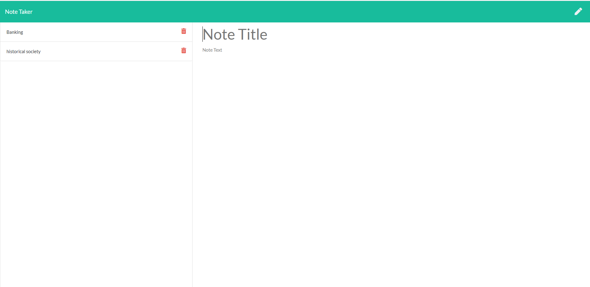
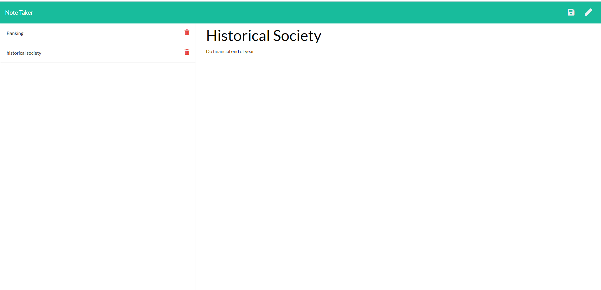
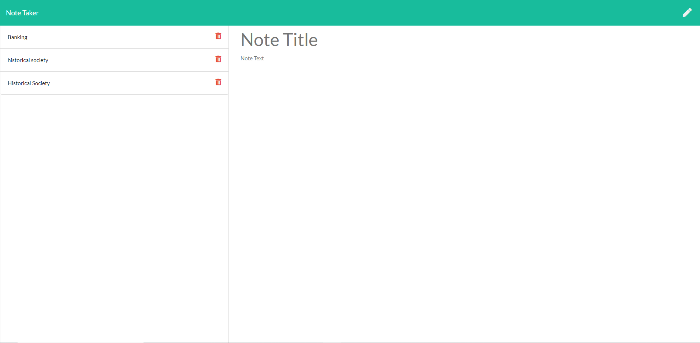
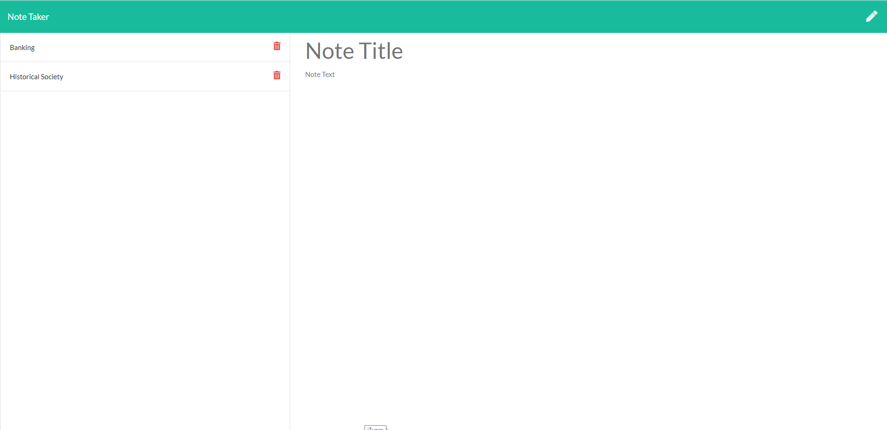

**Susanne's Note Taker**

This application allows a user to view, enter and delete their notes.  The application allows a user to enter a title for their note as well as additional text.  The notes are saved in a file on the server

**Link** 

The link to the GITHUB page is : https://github.com/Susanne85/noteTaker

**Technologies Utilised**

. HTTP 

. Express 

. Javascript

**Application Display**

)

**Liscense**

. MIT

**Contact information**

Susanne Bilney 
email: xkqk2010@gmail.com

